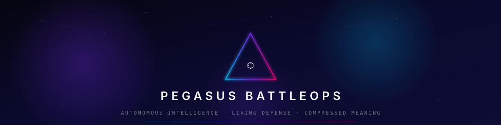
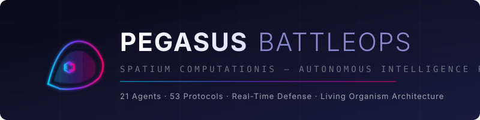

<div align="center">



<br/>
<br/>



<br/>
<br/>

<!-- BADGES -->
[](https://github.com/FreddyCreates/pegasus-battleops/actions/workflows/ci.yml)
[](https://github.com/FreddyCreates/pegasus-battleops/actions/workflows/deploy-app.yml)
[](https://github.com/FreddyCreates/pegasus-battleops/actions)
[](https://python.org)
[](https://fastapi.tiangolo.com)
[](Dockerfile)
[](LICENSE)
[](https://github.com/FreddyCreates/Decentralized-Production-NOVA-Protocol)
[]()
[]()
[]()
[](https://github.com/astral-sh/ruff)
[]()
[]()

---

**An autonomous intelligence platform that watches, classifies, and responds to every signal entering its perimeter.**

[Get Started](#-get-started) · [How It Works](#-how-it-works) · [Features](#-what-you-get) · [For Users](#-for-users) · [For Developers](#-for-developers) · [API Reference](#-api-reference)

</div>

---

## 🌟 What Is Pegasus BattleOps?

**Pegasus BattleOps** (codename: *Spatium Computationis*) is a complete autonomous intelligence platform for the furniture, interiors, and field installation industry.

Think of it as your **always-on operations brain** — it takes messy real-world inputs (emails, PDFs, photos, voice notes, field reports) and turns them into actionable outputs (estimates, bids, install plans, punch lists, change orders) without you needing to understand any code.

> **In one sentence:** You give it information → it gives you ready-to-use documents, estimates, and decisions.

### Who Is This For?

| You Are... | What It Does For You |
|---|---|
| 🏢 **Project Manager** | Auto-generates bids, tracks field updates, builds closeout packets |
| 🪑 **Furniture Dealer** | Creates detailed cost estimates from design files |
| 🔨 **Installer/Contractor** | Produces install packets, punch lists, labor schedules |
| 🎨 **Interior Designer** | Translates your design intent into field-ready instructions |
| 📦 **Warehouse Team** | Processes delivery notes, coordinates with field crews |
| 💼 **Business Owner** | Monitors operations, marketing, security — all in one place |

---

## ✨ What You Get

<table>
<tr>
<td width="50%">

### 📊 Instant Estimates
Upload a design file or description → get a furniture budget and labor bid in seconds. No spreadsheets, no back-and-forth.

### 📋 Auto-Generated Documents
Bid proposals, change orders, install packets, punch lists, closeout packets — all produced automatically from your project data.

### 🛡️ Built-In Security
Your system watches for threats 24/7 with honeypots, bot detection, and adaptive response. No configuration needed.

</td>
<td width="50%">

### 🤖 21 Specialized Agents
Each agent handles one job perfectly — estimating, inspecting, writing documents, monitoring security, managing marketing.

### 🔄 Real-Time Updates
Field workers report progress → the system instantly updates schedules, budgets, and documents. Everyone stays synced.

### 🌐 Web Dashboard
A live interface showing your projects, agents at work, security status, and marketing performance.

</td>
</tr>
</table>

---

## 🚀 Get Started

### Option 1: Docker (Recommended — One Command)

```bash
# Clone the project
git clone https://github.com/FreddyCreates/pegasus-battleops.git
cd pegasus-battleops

# Set your credentials
export NOVA_SOVEREIGN_URL="https://your-nova-instance.com"
export NOVA_SOVEREIGN_TOKEN="your-token"

# Launch
docker compose up -d
```

That's it. Open **http://localhost:8000** in your browser.

### Option 2: Direct Install

```bash
# Clone
git clone https://github.com/FreddyCreates/pegasus-battleops.git
cd pegasus-battleops

# Install Python dependencies
pip install -r spatium-computationis/requirements.txt

# Set environment
export NOVA_SOVEREIGN_URL="https://your-nova-instance.com"
export NOVA_SOVEREIGN_TOKEN="your-token"

# Start the platform
uvicorn spatium_computationis.main:app --reload
```

### Verify It's Running

```bash
curl http://localhost:8000/
```

You'll see:
```json
{"system": "Spatium Computationis", "glyph": "⌬", "status": "active"}
```

### Open the Dashboard

Navigate to **http://localhost:8000/docs** for the full interactive API explorer, or **http://localhost:8000** for the web interface.

---

## 🔮 How It Works

Every piece of information flows through a simple pipeline:

```
   YOU                    THE PLATFORM                     OUTPUT
┌────────┐          ┌──────────────────┐           ┌─────────────┐
│ Email  │          │                  │           │ Bid Proposal│
│ PDF    │   ───►   │   ⌬ INGEST      │   ───►    │ Estimate    │
│ Photo  │          │   ⌬ COMPRESS    │           │ Punch List  │
│ Text   │          │   ≡ ROUTE       │           │ Schedule    │
│ Voice  │          │   ⚡ ACT         │           │ Install Plan│
└────────┘          └──────────────────┘           └─────────────┘
```

**Step 1 — Ingest:** You send anything (email text, a PDF, a photo of a room, a voice note). The system accepts it all.

**Step 2 — Compress:** Raw data gets transformed into structured intelligence objects.

**Step 3 — Route:** The system decides which agent(s) should handle this — estimating? document writing? field inspection?

**Step 4 — Act:** The assigned agent produces the output — a budget, a document, a decision, a notification.

**Step 5 — Learn:** Results feed back into the system. It gets better at routing and producing output over time.

---

## 🤖 The Agent Network

21 specialized agents work together. Each one does **one thing exceptionally well:**

### Operations Agents

| Agent | What It Does |
|---|---|
| **Estimator Mobilia** ◈$ | Creates furniture cost estimates from design specs |
| **Estimator Laboris** ⚒$ | Builds labor bids with crew sizing and scheduling |
| **Inspector Campi** ⟁✓ | Generates punch lists and condition reports from field data |
| **Scriptor Documentorum** ▣✎ | Writes bids, proposals, change orders, closeout packets |
| **Interpres Designii** ✦⇄⚒ | Translates designer intent into installer instructions |
| **Custos Memoriae** ◉ | Remembers everything — client rules, project history, patterns |

### Intelligence Agents

| Agent | What It Does |
|---|---|
| **Auctor Operis** ⌬ | The brain — routes all data, coordinates all agents |
| **Adversary Lab** 🔬 | Studies hostile traffic — extracts attack patterns for defense |
| **Shadow Decryptor** 👁️ | Decodes encrypted or malformed incoming signals |
| **Research Realm** 📚 | Engages with cooperative external AI for knowledge collection |
| **Gatekeeper Porta** 🚪 | Classifies everything entering the system |
| **Defensor Campi** 🛡️ | Active protection — blocks threats in real-time |
| **Vigil Operis** ◎ | 24/7 monitoring — health checks, anomaly detection |
| **Error Eyes** 👀 | Spots failure patterns before they escalate |
| **Adaptio Mentis** 🧠 | Learns from outcomes — improves routing over time |

### Marketing Agents

| Agent | What It Does |
|---|---|
| **Marketing Strategist** 🎯 | Plans campaigns and outreach |
| **Content Creator** ✍️ | Generates marketing and web content |
| **SEO Optimizer** 🔍 | Improves search visibility |
| **Social Media Pilot** 📱 | Manages social presence |
| **Analytics Inspector** 📈 | Tracks performance metrics |
| **Webmaster GoDaddy** 🌐 | Manages domains, DNS, hosting |

---

## 🛡️ Defense System

The platform protects itself automatically:

```
                    INCOMING TRAFFIC
                          │
              ┌───────────┼───────────┐
              ▼           ▼           ▼
        ┌──────────┐ ┌──────────┐ ┌──────────┐
        │COOPERATIVE│ │ HOSTILE  │ │  SHADOW  │
        │           │ │          │ │          │
        │→ Welcome  │ │→ Trap    │ │→ Decode  │
        │→ Engage   │ │→ Study   │ │→ Analyze │
        │→ Collect  │ │→ Block   │ │→ Classify│
        └──────────┘ └──────────┘ └──────────┘
```

- **Honeypot Network** — Fake admin panels, config files, and APIs that trap attackers
- **Bot Fingerprinting** — TLS signatures, behavioral analysis, device profiling
- **Cloudflare Integration** — Edge-level blocking before threats reach your system
- **Adaptive Response** — Automatically escalates defenses based on threat level
- **Known Threat Database** — 80+ tracked attacker IPs and attack patterns

---

## 👤 For Users

### What You Can Do Without Any Code

| Action | How |
|---|---|
| Get a furniture estimate | Send project details to the web dashboard or API |
| Generate a labor bid | Upload specs or describe the scope |
| Create a punch list | Submit field photos or condition notes |
| Produce an install packet | Send design files |
| Check system health | Visit the dashboard |
| View security status | Check the defense feed |

### Using the Web Interface

1. Open **http://localhost:8000** after starting the platform
2. Use the interactive dashboard to submit projects
3. View agent activity and document outputs in real-time
4. Access the security feed for live threat monitoring

### Using the API (Simple)

```bash
# Get a furniture estimate
curl -X POST http://localhost:8000/agents/estimate-furniture \
  -H "Content-Type: application/json" \
  -d '{"text": "50 workstations, Herman Miller Aeron chairs, 10 conference tables"}'

# Get a labor bid
curl -X POST http://localhost:8000/agents/estimate-labor \
  -H "Content-Type: application/json" \
  -d '{"text": "Install 50 workstations across 3 floors, 2-day timeline"}'

# Send any input to the main pipeline
curl -X POST http://localhost:8000/ingest \
  -H "Content-Type: application/json" \
  -d '{"text": "Client wants revised budget for Phase 2 buildout"}'
```

---

## 🔧 For Developers

### Architecture

```
pegasus-battleops/
├── spatium-computationis/        # Core platform
│   ├── main.py                   # FastAPI entrypoint
│   ├── agents/                   # 21-agent network
│   ├── defense/                  # Perimeter defense system
│   ├── protocols/                # 53 production protocols
│   ├── governance/               # 7-level authority hierarchy
│   ├── platform/                 # Task queue, delegation, registry
│   ├── simulation/               # Physics/geometry engines
│   ├── frontend/                 # Web dashboard
│   └── integrations/             # Nova Sovereign, GoDaddy
├── tests/                        # Test suite (237 tests)
├── docs/                         # Documentation & GitHub Pages
├── Dockerfile                    # Container build
└── docker-compose.yml            # One-command deployment
```

### Running Tests

```bash
# Full test suite
pytest tests/ -v

# With coverage
pytest tests/ --cov=spatium_computationis --cov-report=term

# Specific test modules
pytest tests/test_archon.py -v          # ARCHON CogFusion SDK (100 tests)
pytest tests/test_engines.py -v         # Physics/Geometry engines
pytest tests/test_maesi_smoke.py -v     # MAESI embedding SDK
pytest tests/test_archon_pressure.py -v # Pressure/stress tests
```

### Environment Variables

| Variable | Required | Description |
|---|---|---|
| `NOVA_SOVEREIGN_URL` | Yes | Nova Sovereign intelligence backend URL |
| `NOVA_SOVEREIGN_TOKEN` | Yes | Authentication token for Nova Sovereign |

### Tech Stack

| Component | Technology |
|---|---|
| Runtime | Python 3.11+ |
| Framework | FastAPI + Uvicorn |
| AI Backend | Nova Sovereign (decentralized) |
| Container | Docker + Docker Compose |
| Frontend | Jinja2 + HTMX + SSE |
| Testing | pytest (237 tests) |
| CI/CD | GitHub Actions |
| Security | Bandit + CodeQL + Ruff |
| Deployment | GHCR (GitHub Container Registry) |

---

## 📡 API Reference

### Main Pipeline

| Endpoint | Method | What It Does |
|---|---|---|
| `/ingest` | POST | Send any input → get back an actionable result |
| `/field-update` | POST | Report field progress → system updates everything |
| `/memory/recall` | POST | Search project memory and history |

### Direct Agent Access

| Endpoint | Method | Agent |
|---|---|---|
| `/agents/estimate-furniture` | POST | Get a furniture cost estimate |
| `/agents/estimate-labor` | POST | Get a labor bid |
| `/agents/punch-list` | POST | Generate a punch list |
| `/agents/install-packet` | POST | Create an install packet |

### Defense & Platform

| Endpoint | Method | What It Does |
|---|---|---|
| `/ws/defense` | WebSocket | Live threat feed |
| `/api/platform/agents` | GET | View all registered agents |
| `/api/platform/tasks` | POST | Submit tasks to the delegation engine |
| `/api/defense/cloudflare/event` | POST | Receive Cloudflare threat intel |

### Interactive Docs

Start the server and visit **http://localhost:8000/docs** for the complete Swagger UI with try-it-now buttons for every endpoint.

---

## 📊 Platform Scale

| Metric | Value |
|---|---|
| Autonomous Agents | 21 |
| Production Protocols | 53 |
| Test Coverage | 237 tests passing |
| Protocol Categories | 11 |
| Honeypot Traps | 25+ paths across 5 categories |
| Known Threat Signatures | 80+ |
| Governance Levels | 7 |
| Task Bot Types | 6 |

---

## 🧬 The Compression Language

Every operation in the system is represented by a **glyph** — a symbol that carries compressed meaning:

| Glyph | Meaning | Use |
|---|---|---|
| ⌬ | Compressed intelligence | Core data object |
| 🦠 | Living classification | Traffic classification |
| ◈$ | Pricing intelligence | Cost estimates |
| ⚒$ | Labor intelligence | Labor bids |
| ⟁✓ | Field verification | Punch lists |
| ▣✎ | Document generation | Proposals & packets |
| ⚡ | Action generated | System output |
| ↺ | Feedback loop | Learning signal |
| ≡ | Structured routing | Decision routing |

---

## ⚖️ Governance

The platform enforces a 7-level authority hierarchy:

1. **Constitutional** — Foundational rules (immutable)
2. **Procedural** — Operational procedures
3. **Committee** — Multi-agent collective decisions
4. **Personnel** — Agent roles and permissions
5. **Ethics** — Ethical constraints
6. **Openness** — Transparency and data access
7. **Safety** — Override power (can override any level)

---

<div align="center">

---

### Built With

[](https://fastapi.tiangolo.com)
[](https://python.org)
[](https://docker.com)
[](https://github.com/features/actions)

---

**⌬ = Compressed Intelligence · 🦠 = Living System · 👁️ = Nothing Unseen**

*Every signal classified. Every specimen studied. Every resource extracted.*

Powered by [Nova Sovereign](https://github.com/FreddyCreates/Decentralized-Production-NOVA-Protocol)

---

© 2024–2026 FreddyCreates. All rights reserved.

</div>
